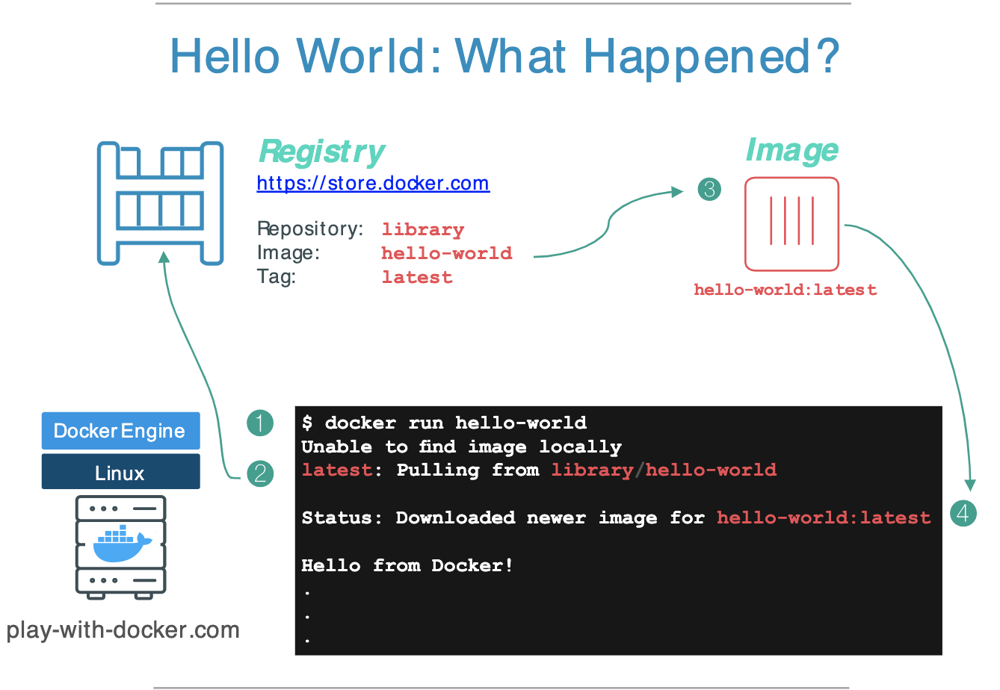
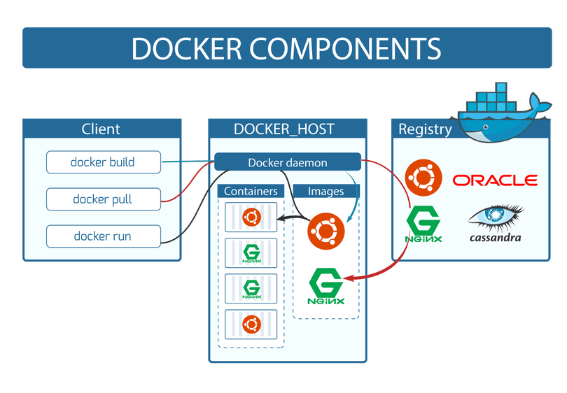
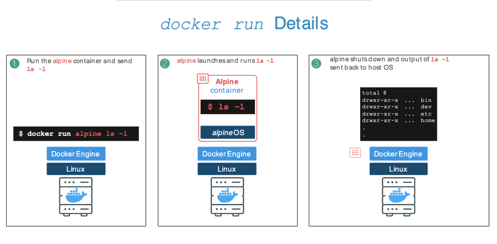
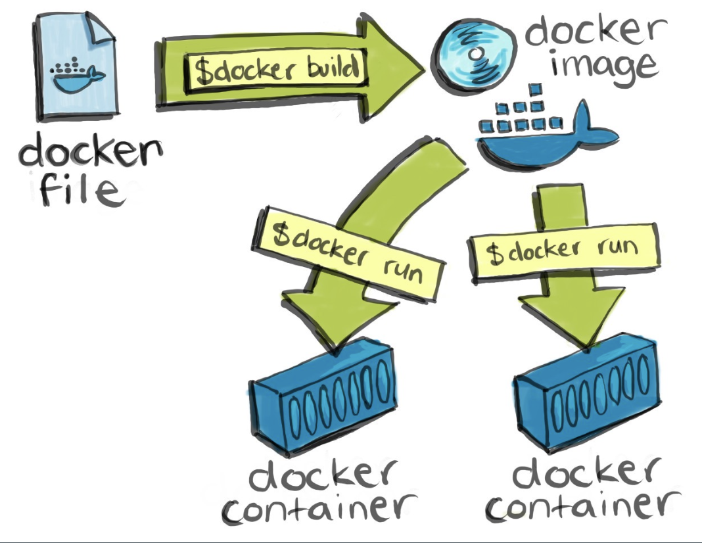
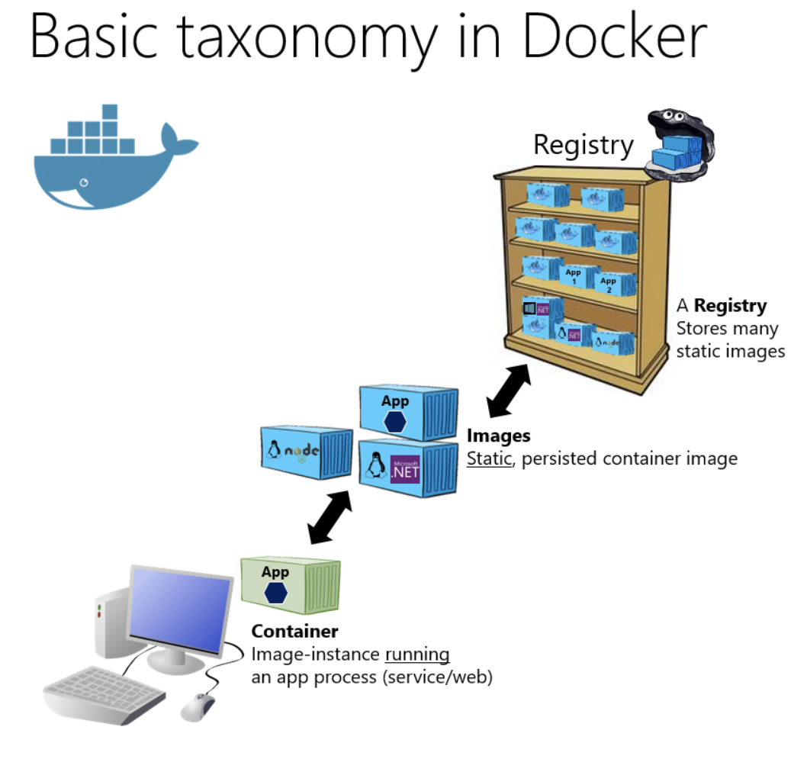

# Checkpoint

- [ ] Container
- [ ] Image
- [ ] Dockerfile
- [ ] Registry
- [ ] Auto build with Github (Bonus!)

---

# Checkpoint

- [ ] Basic docker volume
- [ ] Docker multistage build
- [ ] Real-world example project
- [ ] Deploy container to Heroku (Bonus!)

---

<!-- .slide: style="text-align: left;" -->
# Container
## Lab 1. Run first container

```
docker container run hello-world
```


```
docker run hello-world
```


---



---



---

<!-- .slide: style="text-align: left;" -->

# Image

## Lab 2. Image management

List of images

```
docker image ls
```


Remove image

```
docker image rm {{imageName}} -f
```


```
docker rmi {{imageName}} -f
```


Pull image

```
docker image pull alpine
```


```
docker pull alpine
```


---

<!-- .slide: style="text-align: left;" -->

## Lab 3. Execute command in container

```
docker container run alpine ls -l
```


```
docker run alpine ls -l
```


```
docker container run alpine echo "hello from alpine"
```


```
docker run alpine echo "hello from alpine"
```


```
docker run alpine sh -c 'echo "hello from alpine"'
```


---

<!-- .slide: style="text-align: left;" -->

## Lab 4. Playing in container

```
docker run alpine sleep 3600
```


```
docker ps -a
```


```
docker exec {{containerId}} ls
```


---

<!-- .slide: style="text-align: left;" -->

```
docker exec {{containerId}} echo "Hello to file" > hello.txt
```


```
docker exec {{containerId}} cat hello.txt
```


---

<!-- .slide: style="text-align: left;" -->

### Kill all container

```
docker kill $(docker ps -q)
```


---



---

# Docker way

- **1 application = 1 container**. 
- **Run process in the foreground**.
- **Keep data out of container** -- use volumes.
- **Do not use SSH** (if you need to step into container you can use docker exec command).
- **Avoid manual configurations (or actions) inside container**.

---



---



---


---

# Dockerfile

```
FROM -- set base image
RUN -- execute command in container
ENV -- set environment variable
COPY -- copy file to container
WORKDIR -- set working directory
VOLUME -- create mount-point for a volume
CMD -- set executable for container that maybe used
ENTRYPOINT -- set executable for container that always used
```

---

## CMD VS RUN

- RUN - command triggers while we build the docker image.

- CMD - command triggers while we launch the created docker image.

---

## CMD VS ENTRYPOINT
- Only one command `CMD` or `ENTRYPOINT` in Dokerfile
- CMD - can replace with command when run container
- ENTRYPOINT - can't replace with command when run container

---

## Lab 6. Create Hello world image

```
docker run alpine echo “Hello world”
```


```
docker build -t alpine-hello:0.1 .
```


```
docker run alpine-hello:0.1
```


```
docker history {{imageName}}
```


---

## Lab 7. Pass variable

```
docker build -t alpine-hello:0.2 .
```


```
docker run alpine-hello:0.2
```


```
docker run -e WELCOME=”Hi!!” alpine-hello:0.2
```


---

## Lab 8.1 Run Node.js application

- https://hub.docker.com/_/node (node:14-alpine3.12)

```
docker pull node:14-alpine3.12
```


```
docker run node:14-alpine3.12 node -v
```


---

## Lab 8.2 Run Node.js application by yourself 

1. Add server.js files to own Dockerfile
2. Build own Dockerfile ~> Image
3. Run own image

---

## Build own image

```
docker build -t app-js:0.1 .
```

---

## Run image in foreground process

```
docker run -p 81:80 app-js:0.1
```

---

## Run image in background process

```
docker run -d -p 81:80 app-js:0.1
```

---

# Checkpoint

- [x] Container
- [x] Image
- [x] Dockerfile
- [ ] Registry
- [ ] Auto build with Github (Bonus!)

---

## Push own image to public registry

- Go to ~> http://dockerhub.com
- Register new account
- Create new public registry

---

```
docker login
```


```
docker build -t {{Registry name}}:{{Tag}} .
```


---

```
docker push {{Registry name}}:{{Tag}}
```


```
docker pull {{Registry name}}:{{Tag}}
```


```
docker run {{Registry name}}:{{Tag}}
```

---

---

## Create new repository on Github 

- Go to ~> http://github.com
- Register new account
- Create new public registry
- [:Ref](https://medium.com/platformer-blog/lets-publish-a-docker-image-to-docker-hub-using-a-github-action-f0b17e5cceb3)

---


---


---


---


---


---


---


---


---


---


---


---

# Checkpoint

- [x] Container
- [x] Image
- [x] Dockerfile
- [x] Registry
- [x] Auto build with Github (Bonus!)

---