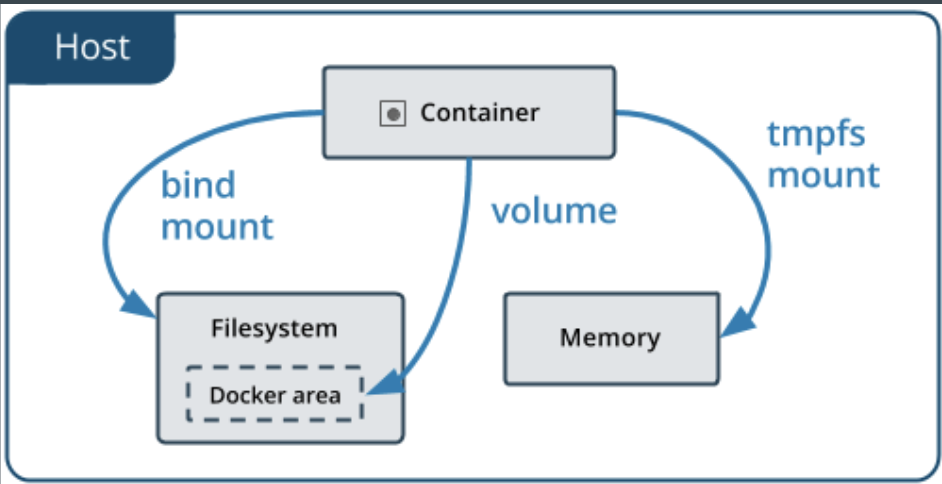
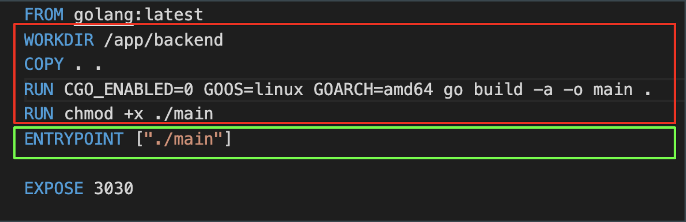
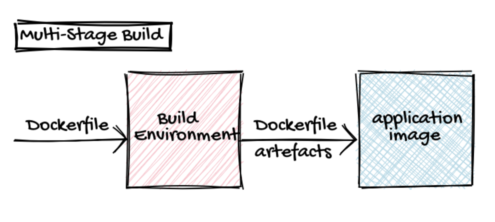
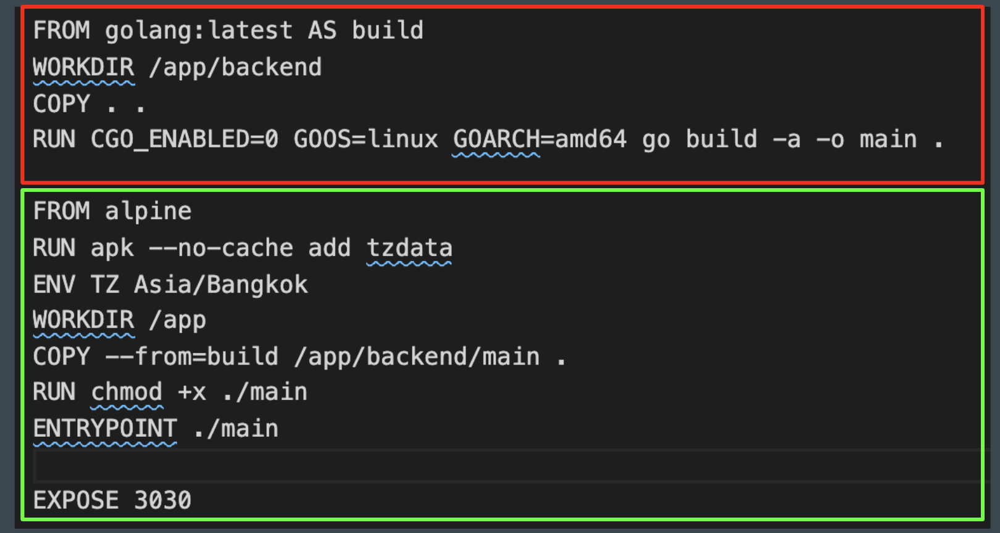
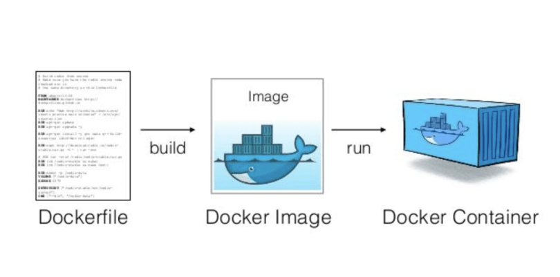

# Checkpoint

- [x] Container
- [x] Image
- [x] Dockerfile
- [x] Registry
- [x] Auto build with Github (Bonus!)

---

# Checkpoint

- [ ] Basic docker volume
- [ ] Docker multistage build
- [ ] Real-world example project
- [ ] Deploy container to Heroku (Bonus!)

---

## Lab 9. Create upload script image

```
docker build -t app-upload:0.1 .
```

```
docker run -d -p 3000:3000 app-upload:0.1
```

```
docker run -P app-upload:0.1
```

---

### Volume mount



---

### 1. tmpfs mount


---

### 2. Bind mount


```
docker run -d -p 3000:3000 -v $(pwd)/uploads:/home/node/uploads app-upload:0.1
```

- -v is a volume mounting `HOST DIRECTORY`:`CONTAINER DIRECTORY`.

---

### 3. Volume


```
docker volume create upload-app
```

```
docker volume ls
```

```
docker volume inspect {{volumeId}}
```

```
docker run -d -p 3000:3000 -v upload-app:/home/node/uploads app-upload:0.1
```

```
docker volume rm upload-app
```

---

## Lab 10. Golang api

```
docker build ???
```

```
docker run ???
```

```
docker images
```

---

### Let's build multistage

```
docker build -f Dockerfile.multi -t app-go:0.2 .
```

---



---




---




---




---

# Checkpoint

- [x] Basic docker volume
- [x] Docker multistage build
- [ ] Real-world example project
- [ ] Deploy container to Heroku (Bonus!)

---

## Real-world example project


[:Ref](https://medium.com/bb-tutorials-and-thoughts/dockerizing-vue-app-with-nodejs-backend-33645f0f50ec)

---

## [Github](https://github.com/nitipatl/vuejs-nodejs-example)

```
git clone https://github.com/nitipatl/vuejs-nodejs-example.git
```

---

```
docker build -t vue-node-image:0.1 .
```

---

```
docker run -it -p  3080:3080 --name vue-node-ui vue-node-image:0.1
```

---

# Checkpoint

- [x] Basic docker volume
- [x] Docker multistage build
- [x] Real-world example project
- [ ] Deploy container to Heroku (Bonus!)

---

## Deploy container to Heroku (Bonus!)

```
heroku login
```

```
heroku container:login
```

```
heroku create
```

---

### Push image to Heroku

```
heroku container:push web --app warm-dusk-59086
```

---

### Release app / run container 

```
heroku container:release web --app warm-dusk-59086
```

```
heroku open --app warm-dusk-59086
```

```
heroku logs --tail --app warm-dusk-59086
```

---
# Checkpoint

- [x] Basic docker volume
- [x] Docker multistage build
- [x] Real-world example project
- [x] Deploy container to Heroku (Bonus!)
- [ ] [Auto deploy with Github (Bonus!)](https://dev.to/heroku/deploying-to-heroku-from-github-actions-29ej)

---

## 12 Factors app

[Link](images/03.08.png)

---